An introduction to Git
================================================================================

----

Why do I need version control ?
================================================================================

As researchers, you want:

- reproducible research
- fast and efficient research

------

A story told by filenames
================================================================================

.. image:: images/version_control.gif

.. raw:: html

   

"Piled Higher and Deeper" by Jorge Cham: www.phdcomics.com

.. raw:: html

  

----

Version control
================================================================================

Version control system:

- keeps all the historical versions for easy tracking.
- benefits team collaboration.
- improves our efficiency.
- can be used as a data center, which makes build automation possible.

----

Setting up Git
================================================================================

----

Creating a project
================================================================================

- Initializing a new project::
    ``$ git init``

    ``Initialized empty Git repository in /home/nelle/Projets/SCBC/git-test/.git/``

- Initializing from an existing project::
    ``$ git clone git://github.com/schacon/grit.git``

----

Configuring Git
================================================================================

.. TODO

- **Locally**: only the git repository you are working on will be affected::
    ``git config [options]``

- **User-wide**: the user's default configuration will be modified in ``~/.git/config``::
    ``git config --global [options]``

- **Globally**: system-wide configuration: all users are going to be affected::
    ``git config --system [options]``

----

Configuring git
================================================================================

- Your identity::
    ``$ git config --global user.name "Your Name Comes Here"``

    ``$ git config --global user.email you@yourdomain.com``

- Setting your editor::
    ``$ git config --global core.editor vim``

- Checking your settings::
    ``$ git config --list``

----

Exercises
================================================================================

- Clone the repository: ``git://github.com/NelleV/SCBC-data.git``
- Configure your git environment:
    - ``git config user.name "Your Name Comes Here"``
    - ``git config user.email you@yourdomain.example.com``
    - ``git config color.ui auto``
- Check your configuration settings by using ``git config --list``

.. raw:: html

  

----

Saving snapshots
================================================================================

----

A few commands
================================================================================

- ``git add``: adds a file to the snapshot we want to take::
    ``$ git add README``

- ``git commit``: save all the files we added to the snapshots::
    ``$ git commit -m "My commit message"``

- ``git status``: show the status of the files of the repository

- ``git log``: show commit log

-----

File status
================================================================================

- Tracked files: files that were in the last snapshots. They can be in 3
  different states:

  - unmodified
  - modified
  - staged

- Untracked files: all the other files

-----

File status lifecycle
================================================================================

.. image:: images/git_file_status_lifecycle.png

.. raw:: html

  

Pro Git Boot, by Scott Chacon: http://git-scm.com/book

.. raw:: html

   

----

Exercises
================================================================================

- Create a new file ``AUTHORS`` and add it.
- Check what the status of your repository is, by using ``git status``.
- Save the state of your repository with ``git commit``
- Now edit the ``AUTHORS`` file, and check the status of the repository.
- Add this file and commit it.
- Type ``git log`` in the repository. What do you see?

----

Deleting and moving files
================================================================================

- ``git rm``: Removes files from the working tree::
      ``git rm FILENAME``

- ``git mv``: Move or rename a file or a directory::
      ``git mv FILENAME TARGET``

----

Exercises
================================================================================

- Rename the file ``AUTHORS`` to ``CONTRIBUTORS`` using ``git mv``
- Now delete this file (don't forget to commit your changes).
- Use ``git log`` to see the history of the repository.

--------

Canceling operations
================================================================================

- ``git reset HEAD``: unstages filename::
    ``$ git reset HEAD filename``

- ``git reset --soft HEAD^``: uncommits the last commit

- ``git checkout``: unmodifies an unstaged file
    ``$ git checkout -- filename1 filename2``

-------

Exercises (1 / 2)
================================================================================

- Create a ``TODO`` file, and add it to the staging area.
- Remove this file from the staging area.
- Create a python script called power.py with the following code in it:
    def power(x):
        return x ** 2
- Add this to the staging area and commit it.

----

Exercises (2 / 2)
================================================================================

- Now edit it again, and add the following function to the bottom of the file:
    def square_root(x):
        return np.sqrt(x)
- Use git checkout to remove the changes you've made to this file. You can
  check what you have done using ``git status``.
- Commit everything.

-------

Branching
================================================================================

----

Commits are repository snapshots.
================================================================================

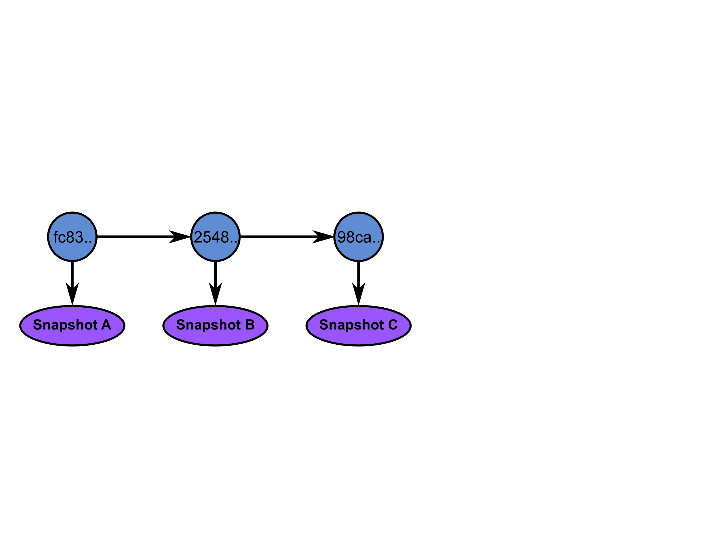

----

A branch is a pointer to a commit.
================================================================================

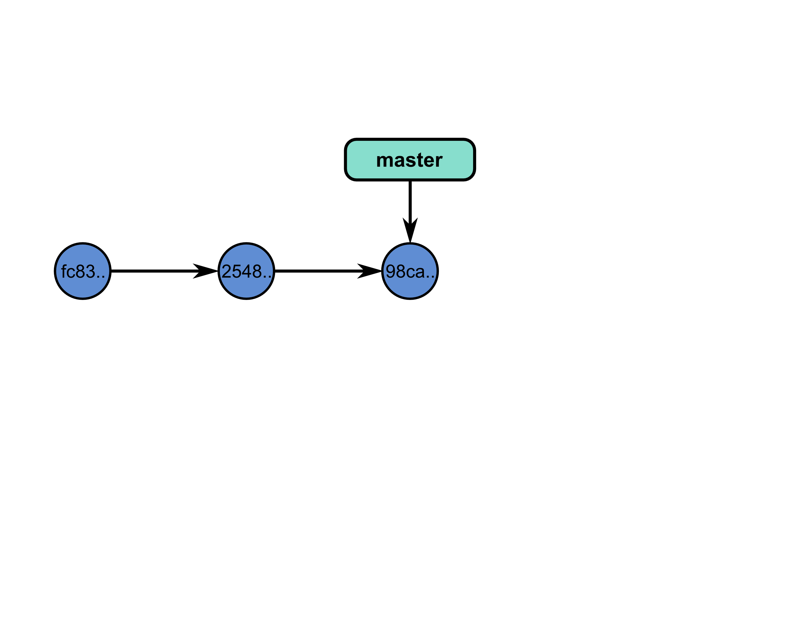

----

So we can have many branches !
================================================================================

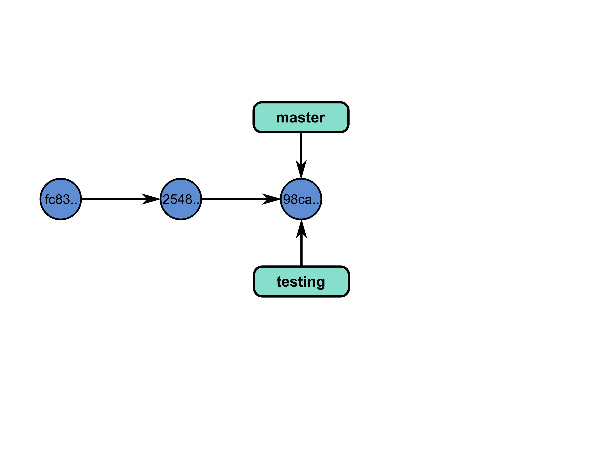

----

But how to know in which branch we are ?
================================================================================

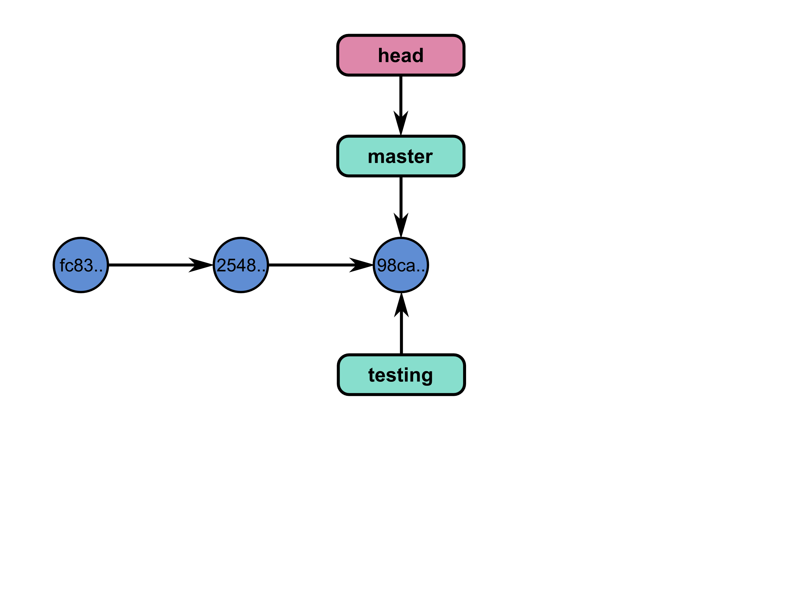

----

We can switch branches.
================================================================================

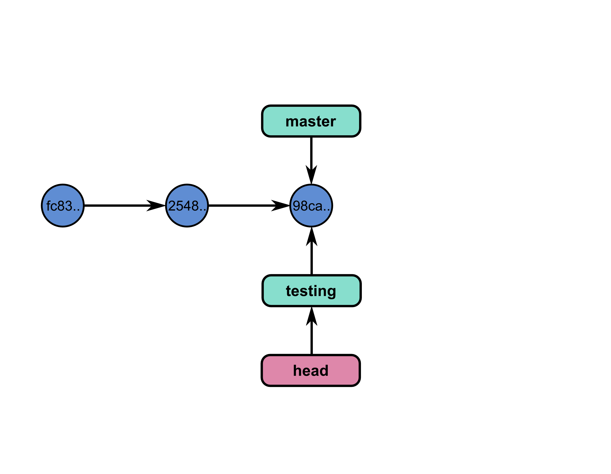

----

And commit in a branch.
================================================================================

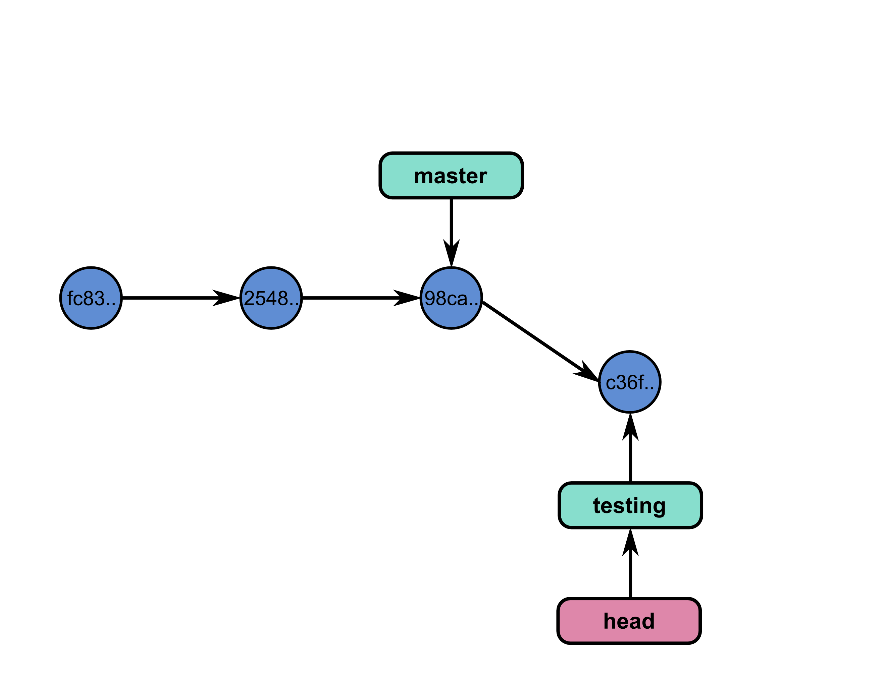

----

Again...
================================================================================

.. image:: images/git_6-300dpi.png
   :scale: 25%

----

And switch branches
================================================================================

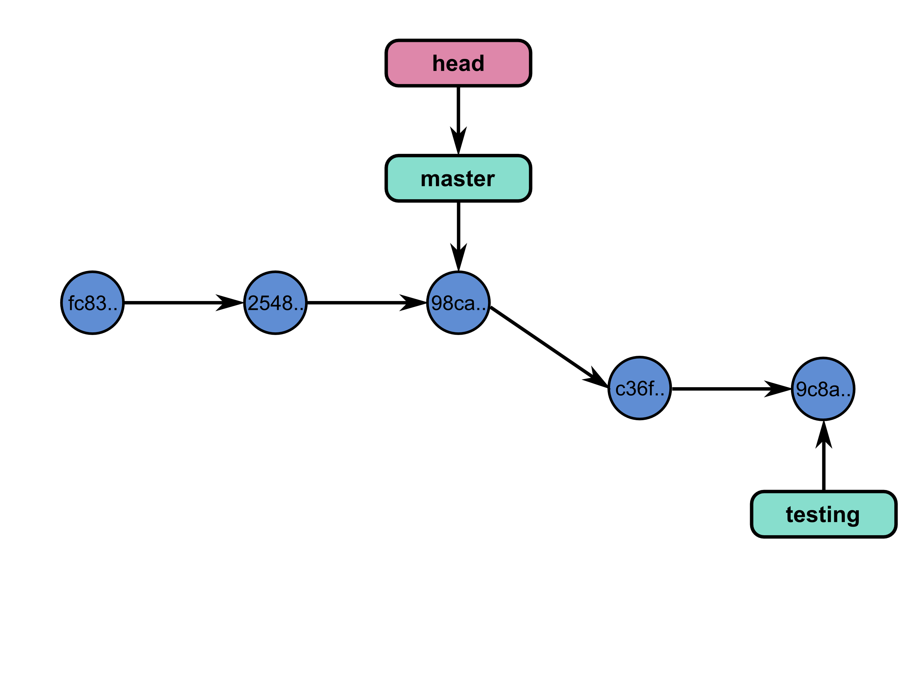

----

The code can diverge.
================================================================================

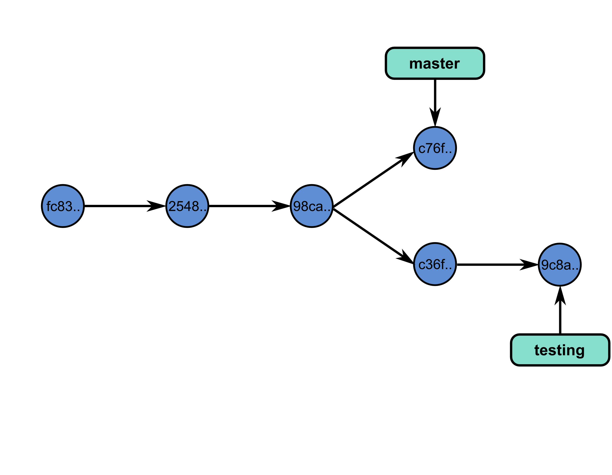

----

Commands
================================================================================

- ``git branch``: manages branches

    - ``git branch``: lists the branches of the local repository
    - ``git branch [branch_name]``: creates a branch
    - ``git branch -d [branch_name]``: deletes a branch

- ``git checkout``: moves to a branch:

  - ``git checkout [branch_name]``: moves to a branch
  - ``git checkout -b [branch_name]``: creates and moves to the branch ``branch_name``

----

Exercises
================================================================================

- Create a new branch ``development``, using ``git branch development``.
- Switch to that branch.
- Check in which branch you are using ``git branch``.
- Create a python script that prints the first 10 integers, and commit it.
- Look at the history of your repository.
- Switch to the branch ``master``, and look again at the history. What do you
  see?

----

Merging
================================================================================

-----

We had two branches
================================================================================

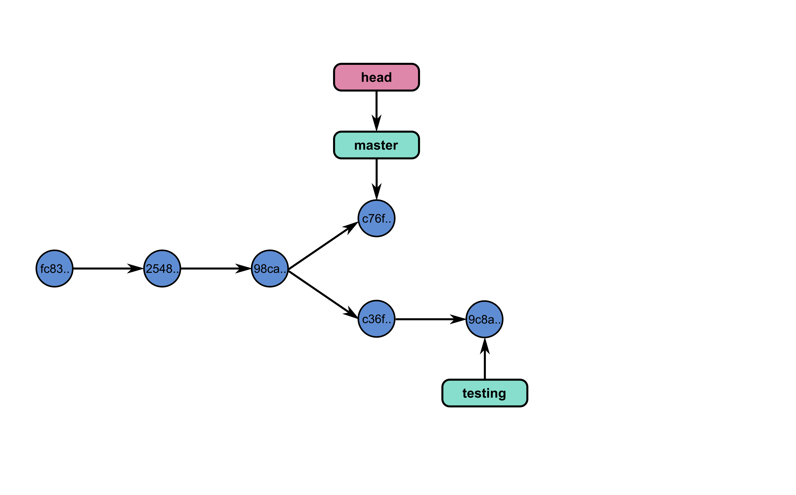

----

Now, let's merge branch test on master
================================================================================

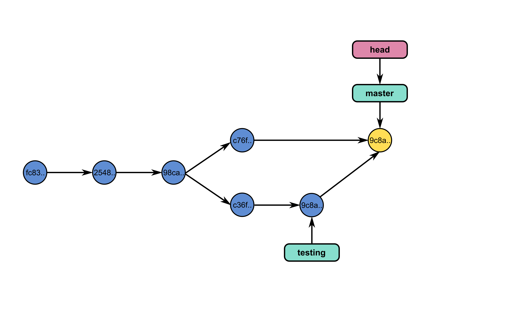

----

And we can continue working
================================================================================

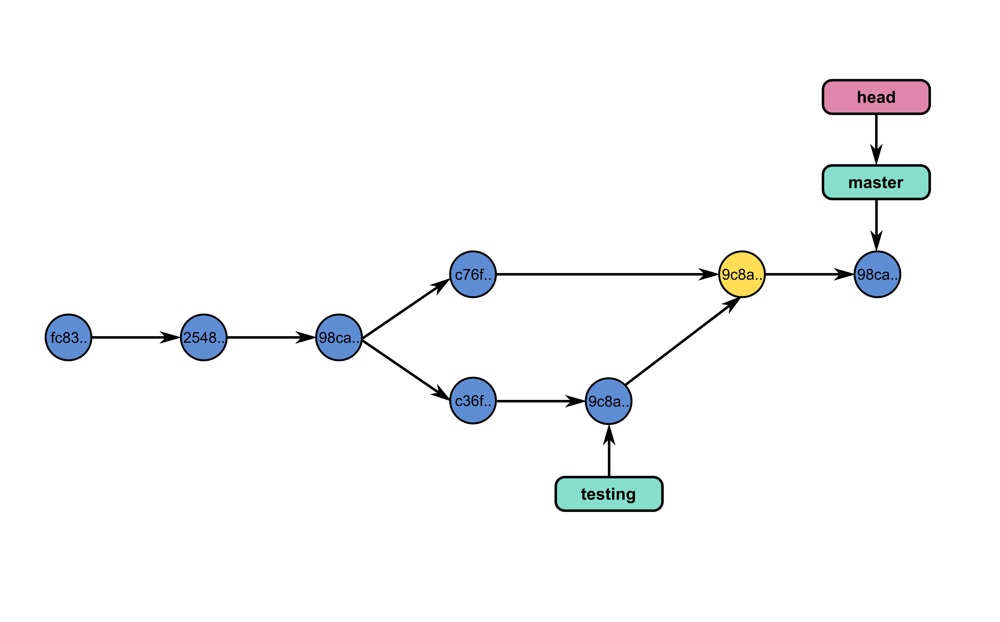

----

Commands
================================================================================

- ``git merge`` - join developments history together
- ``git merge [branch_name]``: merges [branch_name] onto current branch

----

Dealing with conflicts
================================================================================

When a conflict emerges, you must **manually** edit the files::

    <<<<<<< HEAD:calc.py
    print 'the average is', sum(x) / float(len(x))
    print 'sumsqdiffs is', sum(diffs)
    =======
    avg = sum(x) / float(len(x))
    sumsqdiffs = sum(diffs) / float(len(x))

    print 'average is', avg, 'and sumsqdiffs is', sumsqdiffs
    >>>>>>> edgier:calc.py

----

Undo a merge or pull
================================================================================

- ``git reset --hard HEAD``: if you tried to pull or merge, and it resulted in
  a lot of conflicts you don't want to deal with.
- ``git reset --hard ORIG_HEAD`` : you merged a branch which resulted in a
  fast forward, and you want to cancel it.

----

Exercises
================================================================================

- Try deleting branch ``development`` using ``git branch -d development``.
  What do you see ?
- Merge the changes of branch ``development`` in ``master``.
- Try to delete the branch ``development`` once again.

----

Working with a server
================================================================================

----

Remotes
================================================================================

Remote repositories are versions of your project that are hosted on the
Internet or network somewhere.

- ``git remote`` lists the remote servers you have configured.
  Tip: For more verbosity, add ``-v`` option.

- ``git remote add name url``: adds the url as a remote
- ``git remote rm name``: remove the remote ``name``

----

Github
================================================================================

.. image:: images/github.png

----

Updating a repository
================================================================================

- ``git fetch [remote-name]``: fetches the branches on the remote. The branches
  from that remote are then accessible locally in
  ``[remote-name/branch-name]``
- ``git push [remote-name] [branch-name]``: pushed ``[branch-name]`` onto
  remote ``[branch-name]``
- ``git merge [branch-name]``: merges ``[branch-name]`` into the current
  branch

----

Exercises
================================================================================

- Create a github project.
- Add the url of the project as a remote called ``my_repository``.
- Push your changes to github:
  ``git push my_repository master``
- Check on github that you have indeed pushed your changes.
- Fetch the changes from the remote ``origin``.
- Merge the changes from ``origin/master`` to your local master branch (there
  may be a conflict - if so, resolve it).
- Push the new changes to your remote called ``my_repository``.

----

Github's workflow
================================================================================

----

Private git repositories
================================================================================

----

Having private git repositories
================================================================================

- ``Github`` 6$/month accounts
- Setting up a repository on a server

----

Setting up git on a server
================================================================================

In 3 commands:

  - ``git clone --bare --shared my_project my_project.git``
  - ``scp -r my_project.git user@git.example.com:/opt/git``
  - ``git clone user@git.example.com:/opt/git/my_project.git``

----

Thank you for your attention
================================================================================
