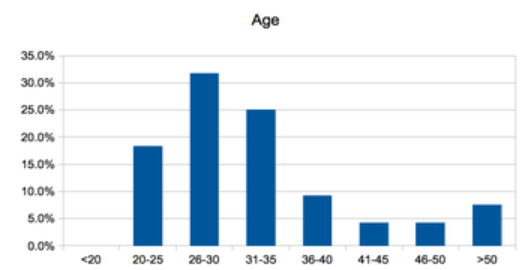
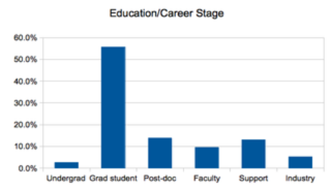
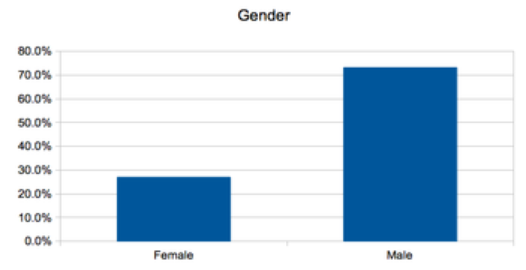
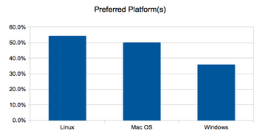

% Software Carpentry - Overview
  Tufts University
% Software Carpentry Team
% June, 2013

## Copy This Lecture!
<br></br>
<br></br>
<br></br>
<br></br>
<br></br>
<br></br>
<a rel="license" href="http://creativecommons.org/licenses/by/3.0/deed.en_US"></a><br /><span xmlns:dct="http://purl.org/dc/terms/" href="http://purl.org/dc/dcmitype/InteractiveResource" property="dct:title" rel="dct:type">Software Carpentry Overview</span> by <a xmlns:cc="http://creativecommons.org/ns#" href="http://software-carpentry.net" property="cc:attributionName" rel="cc:attributionURL">Software Carpentry</a> is licensed under a <a rel="license" href="http://creativecommons.org/licenses/by/3.0/deed.en_US">Creative Commons Attribution 3.0 Unported License</a>.

# More About Software Carpentry

## History

* Founded by Greg Wilson in 1998.
* Open sourced materials 2004-06
* Currently funded by Sloan Foundation

## What We Teach

* Unix Command Line Interface (Shell)
* Version Control
* Python
* Testing

## What We *Actually* Teach

* A program is just another piece of lab equipment
* Programming is a human activity
* Little pieces loosely joined
* Let the computer repeat it
* Paranoia makes us productive
* Better algorithms beat better hardware

*How to THINK like a programmer*

## Who We Teach

<div align="center">
<table>
<tr>
<td></td>
<td></td>
</tr>
<tr>
<td></td>
<td></td>
</tr>
</table>
</div>

## Who We Are

* Aron Ahmadia
* Jessica McKellar
* R. David Murray
* Michael Selik
* Will Trimble

## Our Goals for You

### We will take you on a tour of:
>
* Exploring the Command Line with the Bash Shell
* Principles of Practical Programming with Python
* Managing and Collaborating with your Software, Data, and Manuscripts with Git
* Scientific Computing with Python

# Some High-Level Advice

## Be fluent in multiple languages
<comment>
You speak multiple languages when interacting with a computer.
Choosing to use a new tool, library, or language can be similar to
learning a new language:
</comment>

>
+ There is a high initial startup cost as you learn vocabulary, grammar, and
idioms
<font color=blue>`sum(x*y for x,y in itertools.izip(x_vector, y_vector))`
</font color>
+ You will learn faster by observing and working with others who are more
skilled than you
+ But once you have gained some fluency, you will find yourself capable of
new things!

## Use domain specific languages and libraries to increase your expressivity

* Aim for languages and tools that allow you to express your models and
manage your data simply, whether that is symbolically, numerically, or
like [`chebfun`](http://www2.maths.ox.ac.uk/chebfun/),
a strange union of the two.

## Motivating Example: FEniCS solving Poisson

[Dolfin Example 7](http://fenicsproject.org/documentation/dolfin/1.0.0/python/demo/pde/poisson/python/documentation.html), part of the [FEniCS project](http://fenicsproject.org/)

```{.python}
from dolfin import *
# Create mesh and define function space
mesh = UnitSquare(32, 32)
V = FunctionSpace(mesh, "Lagrange", 1)

# Define Dirichlet boundary (x = 0 or x = 1)
def boundary(x):
    return x[0] < DOLFIN_EPS or x[0] > 1.0 - DOLFIN_EPS

# Define boundary condition
u0 = Constant(0.0)
bc = DirichletBC(V, u0, boundary)

# Define variational problem
u = TrialFunction(V)
v = TestFunction(V)
f = Expression("10*exp(-(pow(x[0] - 0.5, 2) +
    pow(x[1] - 0.5, 2)) / 0.02)")
g = Expression("sin(5*x[0])")
a = inner(grad(u), grad(v))*dx
L = f*v*dx + g*v*ds

# Compute solution
u = Function(V)
solve(a == L, u, bc)
```

## Self-Promoting Example: PyClaw solving Acoustics

[PyClaw example](http://numerics.kaust.edu.sa/pyclaw/tutorial.html)
from [the paper submitted to the SIAM Journal of Scientific Computing]
(http://numerics.kaust.edu.sa/papers/pyclaw-sisc/pyclaw-sisc.html).

```{.python}

from clawpack import pyclaw
from clawpack import riemann

# Define the equations and the solution algorithm
solver = pyclaw.ClawSolver2D(riemann.rp2_euler_4wave)

# Define the problem domain
domain = pyclaw.Domain([0.,0.],[1.,1.],[100,100])
solver.all_bcs = pyclaw.BC.extrap
solution = pyclaw.Solution(solver.num_eqn,domain)

# Set physical parameters
gamma = 1.4
solution.problem_data['gamma']  = gamma

# Set initial data
xx,yy = domain.grid.p_centers
l = xx<0.5; r = xx>=0.5; b = yy<0.5; t = yy>=0.5
solution.q[0,...] = 2.*l*t + 1.*l*b + 1.*r*t + 3.*r*b
solution.q[1,...] = 0.75*t - 0.75*b
solution.q[2,...] = 0.5*l  - 0.5*r
solution.q[3,...] = 0.5*solution.q[0,...]* \
                    (solution.q[1,...]**2+solution.q[2,...]**2) \
                    + 1./(gamma-1.)

# Solve
solver.evolve_to_time(solution,tend=0.3)

# Plot
pyclaw.plot.interactive_plot()
```

## Use REPL Environments for Development

**REPL (read-eval-print-loop)** environments tighten the coupling between
the code you write and the results you see, increasing productivity.

REPL                                        non-REPL
-------------------          -----------------------
Visual Basic                 Supercomputers
Command Line                 C
IPython and Python           C++
MATLAB                       Java
Mathematica                  Fortran
LISP

*We will work with the command line and IPython for
the interactive lecture units today and tomorrow*

## Understand the limitations of floating-point numbers, learn symbolic tools as well
* As a computational scientist, you will likely be working with numerical
systems solved using floating point numbers
    + The excellent article *What Every Computer Scientist Should Know About
    Floating-Point Arithmetic* is a great way to do some advance reading

* Don't limit yourself to numerical computations, use symbolic tools such as
SAGE, SymPy and Mathematica as well when they make sense

# Don't Repeat Yourself (or Others)

## Automate common actions by saving simple blocks of code into **scripts**

>
* A script is a set of commands organized into a single file
* Sometimes it takes a few arguments, but more often there are just
some parameters at the top of the file to modify
* The script is the basest unit of scientific programming, you should be
comfortable writing these whenever you want to save or otherwise document or
repeat your actions
* Use scripts to explore new ideas, they are easy to write and throw away
* **Don't repeat commands into your REPL, save them to a script**

## Refactor commonly used blocks of code into **functions**
>
* Eventually, you will find that your scripts have a lot of repeated code,
or that you are spending a lot of time adjusting parameters at the top of
the file
* Refactor out repeated code into **function calls** in your scripts and
implement the **function** either in the same file or a separate one
* Be comfortable with the calling and return syntax of your programming language
environment, whether it is bash or Python
* **Don't repeat code in scripts, refactor them to functions**

## Group commonly used functions into **libraries**
>
* If you are unlucky enough to have to write a lot of software functions for
your work, you might want to consider designing and releasing a library so that
others do not have to share your misfortune
* You might want to first check that nobody else has implemented the
functionality you need
* If something close exists, it may be worth adapting to your needs if the
project is of high quality and suitably licensed
* *Openly licensed non-commercial libraries tend to have a much longer effective
lifespan than unreleased codes*
* **Share your code with others, and use their code**

# Reduce Complexity

## Basic strategies

>
* Endeavor to use languages and libraries that reduce the complexity of
your work
* It is worth installing a complicated or expensive software tool if your
computations or model are naturally expressed with it
* Always look for opportunities to write **less** code
    + you will have to do less initial work (sometimes)
    + you will introduce less bugs
    + your code will be easier to understand and maintain
* When writing software, try to keep individual functions short, single-purpose,
and avoid excessive nesting

# Organize, Checkpoint, and Collaborate

## Back up your data!

## Organize with wikis

* organize your personal notes into a personal wiki (gollum, gitit, instiki)
* organize your shared notes into a group wiki (gollum, gitit, instiki)

## Use version control for checkpointing and collaboration

* use local version control software to checkpoint personal code development
  + checkpointing your work encourages wild ideas and late-night coding sessions
  + you can easily restore back in the morning if it was a bad idea
* use **distributed version control** to collaborate with others
* We advocate *Git*, but you may be stuck with whatever your group uses
  + though check out git-svn for using Git to collaborate with an svn repository,
  it's awesome!

*We will learn more about working with git and GitHub today and tomorrow*

# Verify and Validate your Code

## Principles of verification and validation
* **verification** - is your code correctly written?
* **validation** - do your computations accurately model the physical phenomena
in question?
* test frameworks help you verify your code, but validation is usually a manual
process
 + although it is desirable to write regression tests that verify previously
 validated results hold true when the code has been modified!
* use the **method of manufactured solutions** to verify correctness of code
* use **comparisons to experiment** to validate code
* use **comparisons to similar software** as an additional check

# Document your Computational Work

## Principles of documentation
* Save every bit of code you use for generating publishable results
* Document and comment your code for yourself as if you will need to understand
it in 6 months
  + use README files liberally
  + as well as file-level, function-level, and inline documentation
* If any piece of code is too complex to easily describe, consider refactoring
it


# Learning Objectives

# Learning Objectives (Shell)

## Given an operating system with a bash command line interface installed on it:
>
* Start the bash terminal on your operating system
* Query the bash program's environment
* Change the bash program's environment
* Change directories to and determine the path of you home directory and specified files
* Generate directory listings and distinguish between files and directories in listings

## Given a directory tree containing files, directories, and sample data, and a working directory:
>
*  Generate wildcard expressions to match to sets of files using filename prefixes, filename suffixes, and fixed-length internal wildcards
*  Determine both absolute and relative paths for a specified file
*  copy, rename, and delete specified files and directories.
*  concatenate and browse files on the terminal
*  determine location on filesystem of specified executables in the path

## Given a directory tree containing files, directories, and sample data, and a working directory:
>
*  display manual pages for system commands and executables and interpret manual pages contents to use new command options
*  construct queries using the find command to list files and directories
*  use pipes to filter output from commands such as ls and wc into filters such as grep, sort, head, and tail to answer questions like "identify the five largest files in the current directory tree" or "display a list of files in the current tree sorted by number of lines"
*  create and invoke an executable script to automate a filtering and piping task

# Learning Objectives (Python)

## Given an IPython shell,

### Command basic data structures to manipulate data
>
* Do arithmetic with integer and floating-point data
* Create, search, replace, and combine, and take subsets of string data
* Create, add to, remove from, and iterate through lists of data
* Create, add to, remove from, and select from dictionaries of data
* Contrast the uses of tuples with lists

### Control code using Boolean expressions, Conditionals, Loops, Functions, and Scripts
>
* Use truthiness to control program flow
* Define and use functions to reuse code
* Run Python scripts from the command line

## Given a formatted data file or pipeline
>
* Read the data programmatically using Python

## Given a set of Python computations
>
* Programmatically save the data as text or Excel data

# Learning Objectives (Version Control)

## Given a project directory containing code and notes associated with your research,
>
* perform a one-time set up to associate the code with a hidden directory
"repository" for saving prior states
* record the precise state of the directory as a "snapshot" so that it can be
accessed in the future.

## Given the name of a project file in the repository,
>
* retrieve a version of that file from any point in the project's history of
snapshots.

## For a particular snapshot of a project,
>
* retrieve the snapshot's author
* retrieve the date that the snapshot was created
* retrieve the difference between the snapshot and another snapshot

## For a project directory that has been modified since its last snapshot
>
* retrieve the difference between the directory and the last snapshot
* selectively "undo" some or all of the changes from the last snapshot

## Given access to your collaborator's snapshots of changes for the same project (paper, code, etc...)
>
* compare the difference between your collaborator's latest snapshot and your
own
* create a unified history of snapshots that includes both your collaborator's
changes and your own.
* resolve any conflicts to files that both you and your collaborators have
modified

## Given a Git version control repository
>
* view the history of snapshots and their "parents"
* distinguish between the snapshot's identifier and the bookmarks "branches"
that point to them
* connect the repository to another repository, a "remote", and send and
retrieve snapshots with your collaborators.

# Learning Objectives (Scientific Python)

## Given an IPython Web Notebook
>
* Combine code with discussion and presentation of visual results
* Manipulate arrays of data with basic linear algebra methods using NumPy
* Efficiently compute basic statistics with NumPy arrays
* Create histograms, line plots, and scatterplots using MatPlotLib

## Given a set of independent and dependent data
>
* Programmatically fit and display it using a linear regression model
* Programmatically make and display predictions

## Schedule Available From [Course Website](http://ahmadia.github.io/boot-camps/2013-06-03-tufts/)

### Today

* **10:00-12:00** Exploring the Command Line with the Bash Shell
* **1:00-4:30** Principles of Practical Programming with Python
* **4:30-5:30** Office Hour

### Tomorrow

* **9:00-12:00** Managing and Collaborating with your Software, Data,
and Manuscripts with Git
* **1:00-4:30** Scientific Computing with Python
* **4:30-5:30** Office Hour


# Closing Thoughts

## Aim for reproducibility
* The goals of non-review scientific publications are to:
    + Describe a new result or approach
    + Convince others of its usefulness
* The **reproducibility** of your publication will greatly benefit both of
these goals
* See <http://figshare.com> for an easy way to store and share your data in
an easily-cited way

# References and Further Reading

# Books

## Pragmatic Programmer, The: From Journeyman to Master
Andrew Hunt and David Thomas

ISBN 978-0132119177

*Describes the important principles and practices of being an effective
programmer, instead of teaching a specific language or technique*

## Code Complete Second Edition
Steve McConnell

ISBN 978-0735619678

*Focuses on principles of software construction, with attention to skills,
testing, and design.*

## Verification and Validation in Scientific Computing
William L. Oberkampf and Christopher J. Roy

ISBN 978-0521113601

*Focuses on verification and validation of numerical solutions to models
described by systems of partial differential and integral equations.*

# Research Literature

## Programming Languages for Scientific Computing
Matthew G. Knepley

Preprint: http://arxiv.org/pdf/1209.1711.pdf

*Gives an overview of modern programming languages and techniques such as code
generation, templates, and mixed-language designs. This is a preprint,
so expect some rough spots.*

## Two Solitudes
Greg Wilson

Slides: http://www.slideshare.net/gvwilson/two-solitudes

*Describes Greg's journey as a scientist and leader for the Software Carpentry
project, provides some insight into the differences between industry and
academics.*

## Best Practices for Scientific Computing
D. A. Aruliah, C. Titus Brown, Neil P. Chue Hong, Matt Davis, Richard T. Guy,
Steven H. D. Haddock, Katy Huff, Ian Mitchell, Mark Plumbley, Ben Waugh,
Ethan P. White, Greg Wilson, Paul Wilson

Preprint: http://arxiv.org/abs/1210.0530

*Good summary paper of many fundamental practices for working with and
developing scientific software. This is a preprint, so expect some rough spots.*

# Web References

## What Every Computer Scientist Should Know About Floating-Point Arithmetic
David Golberg

Web article: http://docs.oracle.com/cd/E19957-01/806-3568/ncg_goldberg.html

*Introduction to the IEEE floating-point standard, its implications, and many of
the common pitfalls when using floating-point numbers in scientific computing*

## The Research Software Engineer
Rob Baxter, Neil Chue Hong, Dirk Gorissen, James Hetherington, and Ilian Todorov

Web article: http://dirkgorissen.com/2012/09/13/the-research-software-engineer

*Discussion of the current challenges to scientific software engineering as
a profession.*

## Science Code Manifesto

http://sciencecodemanifesto.org

*Publicly signed commitment to clear licensing and curation of software
associated with research publications.*
