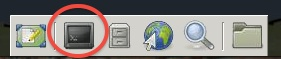
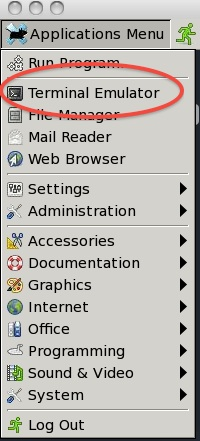

# Quick links into sections of document

* [Shell](#shell) 
* [Data](#data)
* [pwd] (#pwd)
* [cd](#cd)
* [touch](#touch)
* [ls](#ls)
* [Help](#help)
* [rm](#rm)
* [Tab](#tab)
* [history](#history)
* [cat](#cat)
* [head](#head)
* [tail](#tail)
* [less](#less)
* [Wildcards](#wildcards)
* [ExerciseOne](#exerciseone)
* [DataSet](#dataset)

# Shell

What is Shell/ Terminal?

The *shell* is a program

* presents a command line interface
* allows you to control your computer using commands entered
  with a keyboard 

There are many different flavors of Shells/Terminals

* csh  - C-shell
* tcsh - turbo C-shell
* ksh  - Korn shell 
* sh   - Bourne shell
* bash - Bourne again shell

Most system default to the Bourne-again (bash) shell,  we will
use *bash* in these tutorials.

Unix philosophy:
**Make each program do one thing well**

# Access The Shell

## Linux

Depending on the flavor of linux you use Terminal

Centos6 example

Applications Menu -> Teminal Emulator

## Mac OS

Applications -> Utilities -> Terminal

## Install msysgit on Windows

[msysgit download link](https://code.google.com/p/msysgit/downloads/list?q=label:Featured)

eg  on a windowsXP I installed **msysGit-fullinstall-1.8.1.2-preview20130201.exe**	

double-Click to install, when finished you will see a window with a prompt

I wanted to add a shortcut on my Desktop:

    /share/msysGit/add-shortcut.tcl Desktop

# Data

Shell has many uses, today we are going to focus on using it to manage and setup
directories holding project data and related files.  

Keeping your projects organized is am important as
keeping an organized lab book.

[A Quick Guide to Organizinf Computational Biology Projects](http://bit.ly/AADX8F)
Noble WS (2009) A Quick Guide to Organizing Computational Biology Projects. PLoS Comput Biol 5(7): e1000424. doi:10.1371/journal.pcbi.1000424

But often we inherit badly organized and badly labelled data:

To get
the data for this test, you will need internet access and an open shell. 
Just enter the command:

    git clone -b YYYY-MM-PLACE https://github.com/USERNAME/boot-camps.git

Followed by:

    cd boot-camps
    git checkout YYYY-MM-PLACE

You should now have all the data you need for this tutorial (yea!)

## Navigation

### pwd

To find out where you are in the filesystem use **pwd** (print working directory):

    pwd

Which will give results looking like the following

using (msysgit prompt)

    /c/Documents and Settings/Administrator/My Documents/boot-camps

using (ipython prompt)

    C:\\Documents and Settings\\Administrator\\My Documents\\boot-camps

using (OSX)

    /Users/cindeem/Documents/boot-camps

using (linux)

    /home/jagust/cindeem/boot-camps

Note that the results are dependent on the OS/terminal combo you are using...
from here on out in the tutorial, I will stick to a standard OSX terminal output
(very simliar to linux output). 

### cd

**cd** allows you to change directories.

* Used above to get into boot-camps directory
* We want to move into the **shell** directory

command to move to shell directory:

    cd shell
    pwd

    /Users/cindeem/Documents/boot-camps/shell

If we wanted to go backward to the original directory we use ../ to signify going backward,
use **pwd** to get a sense of where you are:

    cd ../
    pwd
    /Users/cindeem/Documents/boot-camps/

You can be anywhere in the filesystem, if you want to go to your home directory just typing **cd** alone
will take you home:

    cd
    pwd
    /Users/cindeem

Lets get back to our shell directory, we can use a full path directive to get there:

    cd /Users/cindeem/Documents/boot-camps/shell
    pwd

    /Users/cindeem/Documents/boot-camps/shell

### touch

touch creates an empty file:

    touch myemptyfile.txt

### ls

To see the file you just created type:

    ls

    Readme.md		ex_data.txt		    linux-term.jpg
    data			generate_data.py	linux-term2.jpg
    dictionary.txt	hello			    myemptyfile.txt

You can also use a *relative* path with ls. For example if I want to see what is in data

    ls data

We could also look up a directory

    ls ../

Or put in an absolute or **full path**  eg /Users/cindeem/Documents/boot-camps/shell/data

    ls /Users/cindeem/Documents/boot-camps/shell/data

Most unix commands will also take additional arguments or flags.

For example, to get more information use the **-l** flag (stands for *long format*):

    ls -l

    total 88K
    drwxrwxr-x 9 cindeem staff  139 Mar  2 14:38 data/
    -rw-rw-r-- 1 cindeem staff 5.2K Mar  2 14:38 dictionary.txt
    -rw-rw-r-- 1 cindeem staff  236 Mar  2 14:38 ex_data.txt
    -rw-rw-r-- 1 cindeem staff 8.5K Mar  2 14:38 generate_data.py
    -rwxrwxr-x 1 cindeem staff   33 Mar  2 14:38 hello*
    -rw-rw-r-- 1 cindeem staff  41K Mar  2 14:38 linux-term2.jpg
    -rw-rw-r-- 1 cindeem staff 9.6K Mar  2 14:38 linux-term.jpg
    -rw-rw-r-- 1 cindeem staff    0 Mar  2 14:39 myemptyfile.txt
    -rw-rw-r-- 1 cindeem staff 3.4K Mar  2 14:38 Readme.md

If we look at the output we see a number of things, consider your new file *myemptyfile.txt*

**-rw-rw-r--** 

The first part gives us info about permissions on the file (we will talk about this later).
But the first character **-**, signifies that this item is a file, not a directory.

    -rw-rw-r-- 1 cindeem staff    0 Mar  2 14:39 myemptyfile.txt

In contrast, look at *data*. Data is a directory, so the first character in **drwxrwxr-x** is **d**.

    drwxrwxr-x 9 cindeem staff  139 Mar  2 14:38 data/

Both show the user, group pair **cindeem staff**.  this tells use a little about who created the file.

We also see timestamps on the file, showing it was created (or modified) on **Mar  2  14:38** (March 2 at 2:38pm).

    drwxrwxr-x 9 cindeem staff  139 Mar  2 14:38 data/

Lets create a new file, but we are going to do something odd, we are going to add a **.** to the beginning of the
filename:

    touch .hiddenfile

If we use **ls** again this file will not show up, this is beacuse of the leading **.**

However, we can see these files using the **-a** flag:

    ls -a

    ./     dictionary.txt    hello*           linux-term.jpg
    ../    ex_data.txt       .hiddenfile      myemptyfile.txt
    data/  generate_data.py  linux-term2.jpg  Readme.md

We can now see the *hidden* file (.hiddenfile). Often these files are configuration files or temporary files, 
and in general you do not edit or work with them. 
But they will be useful to know about, and sometimes you do want to access them.

Lets see one more useful **ls** flag, **-rt**.  This flag combo (-t for *"order by time"* and -r for *"reverse"*) will
order your files by the time they were last changed, but with the oldest first, and youngest last.
In the example below I will also add **-l** so we can see the timestamps:
       
    -rwxr-xr-x  1 cindeem  staff     33 Feb 27 21:28 hello
    -rw-r--r--  1 cindeem  staff   8667 Feb 27 21:28 generate_data.py
    -rw-r--r--  1 cindeem  staff    236 Feb 27 21:28 ex_data.txt
    -rw-r--r--  1 cindeem  staff   5321 Feb 27 21:28 dictionary.txt
    drwxr-xr-x  9 cindeem  staff    306 Feb 27 21:28 data
    -rw-r--r--  1 cindeem  staff  41166 Mar  2 13:32 linux-term2.jpg
    -rw-r--r--  1 cindeem  staff   9737 Mar  2 13:32 linux-term.jpg
    -rw-r--r--  1 cindeem  staff   3702 Mar  2 14:21 Readme.md
    -rw-r--r--  1 cindeem  staff      0 Mar  2 15:03 myemptyfile.txt
           
This can be a useful tool if you want to see what you have most recently changed in a large directory.

## Help

Command line programs have many additional arguments or flags. It is quite easy to access this information from the
command line:

### man (short for manual)

Prints out usage for a given command:

    man ls

To move around in man

* q  (quit)
* arrow-down, arrow-up to navigate up and down
* g (beginning of file), G (end of file)
* /<pattern> to search for pattern eg. /-t

### --help (msysgit, windows)

On msysgit, **man** is not implemented, but to get usage information for a command

    ls --help

## rm

Sometimes we make things we dont want to keep. This is where **rm** (remove) comes in.  Lets get rid of our hidden file,
and then us **ls -a**  to make sure it is gone:

    rm .hiddenfile
    ls -a

**rm** can be a little scary, what if we had chosen **rm data**, would we lose all our precious data?

    rm data

    rm: data: is a directory

Luckily it will only remove local files.

rm also has a **-r** (recursive) flag. to get rid of a directory and all of its
contents you could use rm -r, but be careful, it will bite you. (with great power comes great responsibility)

# Laziness

One of the nice things about using the shell, it allows you to be lazy. Here are some tips for being lazy.

## Tab

when using any command in a terminal, the terminal will try to guess what you are trying to do. To see how this works
at the shell prompt enter **ls h <tab>**:

    ls h<tab>

You should find it prints out hello for you (as this file exists in the directory and is the only file that starts with
**h** ).

Now try this with **d**

    ls d<tab>
    ls d<tab><tab>

With **d** you had to hit the tab key twice. This is because there was not a unique option, instead there are multiple
files/directories that begin with **d**. Hitting tab twice shows your possible options. What do you think will happen if
you try?

    ls da<tab>

## History

When at an empty promt, you can use your *up arrow* and *down arrow* to cycle through your previously used commands.
This can save you alot of typing.

In addition there is a *history* command which will print out the history of your recently used shell commands

    history

# Read File
Make sure you are in the **<basedir>/boot-camps/shell** directory
(what tool should you use, can you navigate to this direcotry?)

There should be a file called **dictionary.txt**. How do we read the contents of this file?

## Cat

**cat** is a tool to concatenate or list files. Use cat to look at the contents of **dictionary.txt**

    cat dictionary.txt

Thats alot of text...

## Head

**head** allows us to look at just the first lines of a file

    head dictionary.txt

## Tail

**tail** allows us to look at the last few lines of a file

    tail dictionary.txt

## less 
Less allows you to view the contents of a text file, with control over 
navigating the file:

    less dictionary.txt

to navigate:
* **q**  (short for quit) closes the file
* **g**  go to start of file
* **G** go to end of file
* you can also use *up-arrow* and *down-arrow*
* **spacebar**  scroll down page
* **/<pattern>**  looks for pattern in file

###ExcerciseOne

1. use less and see if dictionary.txt contains *egg*

## grep

**grep** allows you to search for patterns 

## pipe  **|**

Allows you to take output from one command and feed it into another command

For example, we can use **cat** to list the contents of dictionary.txt, and then use the **pipe |**
to send this to **grep** and look for words that contain **egg**

    cat dictionary.txt | grep egg

To get all the words that start with **y**  we use the carrot symbol **^**

    cat dictionary.txt | grep ^y

Another option is the bracket **[ ]**  which can allow you to look for multiple items.

* [0-9] match any number
* [a-c] match anything that has *a* or *b* or *c*

### ExerciseTwo

1. are there any lines in dictionary.txt that contain numbers?
2. are there any lines in ex_data.txt that contain numbers?
3. combine ls and grep with pipe to find all the directories in data that contain an **e**

## redirect 

In the shell you can use **>** or **>>** to redirect output the a new file. This is like **pipe**

To save output to a file

    cat dictionary.txt > newdictionary

To append to the end of the file

    cat dictionary.txt >> newdictionary

### ExerciseThree

1. combine *cat*, *pipe*, and *redirect* to put all words starting with *g* into a new file **g_dictionary.txt*

    
# DataSet

**Our data set: Cochlear Implants**

A cochlear implant is a small electronic device that is surgically
implanted in the inner ear to give deaf people a sense of
hearing. More than a quarter of a million people have them, but there
is still no widely-accepted benchmark to measure their effectiveness.
In order to establish a baseline for such a benchmark, our supervisor
got teenagers with CIs to listen to audio files on their computer and
report:

1.  the quietest sound they could hear
2.  the lowest and highest tones they could hear
3.  the narrowest range of frequencies they could discriminate

To participate, subjects attended our laboratory and one of our lab
techs played an audio sample, and recorded their data - when they
first heard the sound, or first heard a difference in the sound.  Each
set of test results were written out to a text file, one set per file.
Each participant has a unique subject ID, and a made-up subject name.
Each experiment has a unique experiment ID. The experiment has
collected 351 files so far.

The data is a bit of a mess! 
* inconsistent file names, there
* extraneous "NOTES" files
* data is spread across many directories.

We are going to use shell commands to get this data into shape. By the end we would like to:

1.  Put all of the data into one directory called "alldata"

2.  Have all of the data files in there, and ensure that every file
    has a ".txt" extension

3.  Get rid of the extraneous "NOTES" files

If we can get through this example in the available time, we will move
onto more advanced shell topics...

## Wildcards

Navigate to the `~/boot-camps/shell/data/THOMAS` directory. This
directory contains our hearing test data for THOMAS. If we type `ls`,
we will see that there are a bunch of files which are just four digit
numbers. By default, `ls` lists all of the files in a given
directory. The `*` character is a shortcut for "everything". Thus, if
you enter `ls *`, you will see all of the contents of a given
directory. Now try this command:

    ls *1

This lists every file that ends with a `1`. This command:

    ls /usr/bin/*.sh

Lists every file in `/usr/bin` that ends in the characters `.sh`. And
this command:

    ls *4*1

lists every file in the current directory which 
* contains the number `4`
* ends with the number `1`

There are four such files: `0241`,`0341`, `0431`, and `0481`. 

* * * *
### ExerciseThree

Do each of the following using a single `ls` command without
navigating to a different directory.

1.  List all of the files in `/bin` that contain the letters `sh`
2.  List all of the files in `/bin` that contain the letter `a` or the letter `z`

* * * *

        

