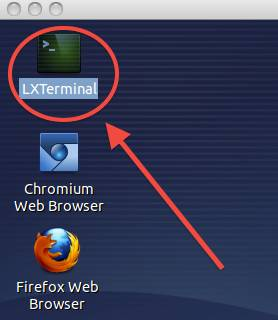

# Quick links into sections of document

* [pwd] (#pwd)
* [whoami](#whoami)
* [cd](#cd)
* [touch](#touch)
* [ls](#ls)
* [Help](#help)
* [rm](#rm)
* [Tab](#tab)
* [history](#history)
* [cat](#cat)
* [head](#head)
* [tail](#tail)
* [less](#less)
* [grep](#grep)
* [pipe](#pipe)
* [redirect](#redirect)
* [Wildcards](#wildcards)
* [mv](#mv)
* [mkdir](#mkdir)
* [env](#env)
* [gedit](#gedit)
* [.bashrc](#.bashrc)
* [grin](#grin)

# Shell

What is Shell/ Terminal?

The *shell* is a program

* presents a command line interface
* allows you to control your computer using commands entered
  with a keyboard 

There are many different flavors of Shells/Terminals

* csh  - C-shell
* tcsh - turbo C-shell
* ksh  - Korn shell 
* sh   - Bourne shell
* bash - Bourne again shell

Most system default to the Bourne-again (bash) shell,  we will
use *bash* in these tutorials.

Unix philosophy:
**Make each program do one thing well**

# Access The Shell

## Linux

Depending on the flavor of linux you use Terminal

Virual Machine ubuntu example

## Mac OS

Applications -> Utilities -> Terminal

# Data

Shell has many uses, today we are going to focus on using it to manage and setup
directories holding project data and related files.  

Keeping your projects organized is as important as
keeping an organized lab book.

[A Quick Guide to Organizinf Computational Biology Projects](http://bit.ly/AADX8F)
Noble WS (2009) A Quick Guide to Organizing Computational Biology Projects. PLoS Comput Biol 5(7): e1000424. doi:10.1371/journal.pcbi.1000424

But often we inherit badly organized data:

To get
the data for this tutorial, you will need internet access and an open shell. 
Just enter the command:

    git clone -b 2013-03-lbl-2 https://github.com/jkitzes/boot-camps.git

Followed by:

    cd boot-camps
    git checkout 2013-03-lbl-2

You should now have all the data you need for this tutorial (yea!)

## Navigation

### pwd

To find out where you are in the filesystem use **pwd** (print working directory):

    pwd

Which will give results looking like the following

using virtual machine

    /home/swc/boot-camps

using (OSX)

    /Users/cindeem/Documents/boot-camps

Note that the results are dependent on the OS/terminal combo you are using...
from here on out in the tutorial, I will stick to virtual machine terminal output
(very simliar to Mac OSX, linux output).

### whoami

**whoami** is a command that identifies your user name. If you are using the virtual machine, your 
user name is **swc**  (software carpentry). If you are using an install on your own machine, this will 
reflect your user name on that machine.

### cd

**cd** allows you to change directories.

* Used above to get into boot-camps directory
* We want to move into the **shell** directory

command to move to shell directory:

    cd shell
    pwd

    /home/swc/boot-camps/shell

If we wanted to go backward to the original directory we use ../ to signify going backward,
use **pwd** to get a sense of where you are:

    cd ../
    pwd
    /home/swc/boot-camps

You can be anywhere in the filesystem, if you want to go to your home directory just typing **cd** alone
will take you home (in this example your user name is **swc**):

    cd
    pwd
    /home/swc

Lets get back to our shell directory, we can use a full path directive to get there:

    cd /home/swc/boot-camps/shell
    pwd

    /home/swc/boot-camps/shell

### touch

touch creates an empty file:

    touch myemptyfile.txt

### ls

To see the file you just created type:

    ls

    data    dictionary.txt  ex_data.txt myemptyfile.txt Readme.md   term.jpg

You can also use a *relative* path with ls. For example if I want to see what is in data

    ls data

    Bert    bert_data.csv   bert_data.xls   generate_data.py    hello   Thomas

We could also look up a directory

    ls ../

Or put in an absolute or **full path**  eg /home/swc/boot-camps/shell/data

    ls /home/swc/boot-camps/shell/data

Most unix commands will also take additional arguments or flags.

For example, to get more information use the **-l** flag (stands for *long format*):

    ls -l

    total 88K
    drwxrwxr-x 9 swc swc  139  Mar  2 14:38 data/
    -rw-rw-r-- 1 swc swc 5.2K  Mar  2 14:38 dictionary.txt
    -rw-rw-r-- 1 swc swc  236  Mar  2 14:38 ex_data.txt
    -rw-rw-r-- 1 swc swc    0  Mar  2 14:39 myemptyfile.txt
    -rw-rw-r-- 1 swc swc 3.4K  Mar  2 14:38 Readme.md
    -rw-rw-r-- 1 swc swc 13973 Mar  2 19:48 term.jpg

If we look at the output we see a number of things, consider your new file *myemptyfile.txt*

**-rw-rw-r--** 

The first part gives us info about permissions on the file (we *may* talk about this later).
But the first character **-**, signifies that this item is a file, not a directory.

    -rw-rw-r-- 1 swc swc    0 Mar  2 14:39 myemptyfile.txt

In contrast, look at *data*. Data is a directory, so the first character in **drwxrwxr-x** is **d**.

    drwxrwxr-x 9 swc swc  139 Mar  2 14:38 data/

Both show the user, group pair **swc swc**.  this tells use a little about who created the file.

We also see timestamps on the file, showing it was created (or modified) on **Mar  2  14:38** (March 2 at 2:38pm).

    drwxrwxr-x 9 swc swc  139 Mar  2 14:38 data/

Lets create a new file, but we are going to do something odd, we are going to add a **.** to the beginning of the
filename:

    touch .hiddenfile

If we use **ls** again this file will not show up, this is beacuse of the leading **.**

However, we can see these files using the **-a** flag:

    ls -a

    .   data            ex_data.txt     myemptyfile.txt     term.jpg 
    ..  dictionary.txt  .hiddenfile     Readme.md

We can now see the *hidden* file (.hiddenfile). Often these files are configuration files or temporary files, 
and in general you do not edit or work with them. 
But they will be useful to know about, and sometimes you do want to access them.

#### Excercise

there are usually many hidden files in your home directory, use ls -a to see them

Lets see one more useful **ls** flag, **-rt**.  This flag combo (-t for *"order by time"* and -r for *"reverse"*) will
order your files by the time they were last changed, but with the oldest first, and youngest last.
In the example below I will also add **-l** so we can see the timestamps:
       
    total 48
    -rw-rw-r--  1   swc swc 13973   Mar  4 19:48    term.jpg
    -rw-rw-r--  1   swc swc 15621   Mar  4 19:48    Readme.md
    -rw-rw-r--  1   swc swc   236   Mar  4 19:48    ex_data.txt
    -rw-rw-r--  1   swc swc  5231   Mar  4 19:48    dictionary.txt
    -rw-rw-r--  1   swc swc  4096   Mar  4 19:48    data
    -rw-rw-r--  1   swc swc     0   Mar  6 19:53    myemptyfile.txt

This can be a useful tool if you want to see what you have most recently changed in a large directory.

## Help

Command line programs have many additional arguments or flags. It is quite easy to access this information from the
command line:

### man (short for manual)

Prints out usage for a given command:

    man ls

To move around in man

* q  (quit)
* arrow-down, arrow-up to navigate up and down
* g (beginning of file), G (end of file)
* /<pattern> to search for pattern eg. /-t

### rm

Sometimes we make things we dont want to keep. This is where **rm** (remove) comes in.  Lets get rid of our hidden file,
and then us **ls -a**  to make sure it is gone:

    rm .hiddenfile
    ls -a

**rm** can be a little scary, what if we had chosen **rm data**, would we lose all our precious data?

    rm data

    rm: cannot remove `data': Is a directory

Luckily it will only remove local files.

rm also has a **-r** (recursive) flag. to get rid of a directory and all of its
contents you could use rm -r, but be careful, it will bite you. You can use the **-i** flag to prompt you before each
removal. (y for `yes please remove` n for `no, my mistake`

Also if you plan to remove files, it is often a good idea to use **ls** to check that you are removing the correct files

    ls myemptyfile.txt

If you see the file, and you know it is the one you want to remove

    rm myemptyfile.txt

(with great power comes great responsibility)

Lets return to our data that we need to clean up. Often you will inherit data that has files you do not want to keep
(they might be empty, or contain bad data etc). In our current data set, there is a jnkfile in data/Bert.

#### Exercise

1. find jnkdata, and validate that it does not contain any useful data
2. remove jnkdata

# Laziness

One of the nice things about using the shell, it allows you to be lazy. Here are some tips for being lazy.

### Tab

when using any command in a terminal, the terminal will try to guess what you are trying to do. To see how this works
at the shell prompt enter **ls e <tab>**:

    ls e<tab>

You should find it prints out ex_data.txt for you (as this file exists in the directory and is the only file that starts with
**e** ).

Now try this with **d**

    ls d<tab>
    ls d<tab><tab>

With **d** you had to hit the tab key twice. This is because there was not a unique option, instead there are multiple
files/directories that begin with **d**. Hitting tab twice shows your possible options. What do you think will happen if
you try?

    ls da<tab>

### history

When at an empty promt, you can use your *up arrow* and *down arrow* to cycle through your previously used commands.
This can save you alot of typing.

In addition there is a *history* command which will print out the history of your recently used shell commands

    history

# Read File
Make sure you are in the **<basedir>/boot-camps/shell** directory
(what tool should you use, can you navigate to this direcotry?)

There should be a file called **dictionary.txt**. How do we read the contents of this file?

### cat

**cat** is a tool to concatenate or list files. Use cat to look at the contents of **dictionary.txt**

    cat dictionary.txt

Thats alot of text...

### head

**head** allows us to look at just the first lines of a file

    head dictionary.txt

### tail

**tail** allows us to look at the last few lines of a file

    tail dictionary.txt

### less 
Less allows you to view the contents of a text file, with control over 
navigating the file:

    less dictionary.txt

to navigate:
* **q**  (short for quit) closes the file
* **g**  go to start of file
* **G** go to end of file
* you can also use *up-arrow* and *down-arrow*
* **spacebar**  scroll down page
* **/<pattern>**  looks for pattern in file

Side note:: cat, head, tail, and less are meant to be used to look at text files, not binary files. 
You will get unexpected results looking at binary files, but you will be able to see them.

#### Excercise

1. use less and see if dictionary.txt contains *egg*
2. use less to look at /home/swc/boot-camps/shell/data/bert_data.csv
3. use less to look at /home/swc/boot-camps/shell/data/bert_data.xls

### grep

**grep** allows you to search for patterns 

### pipe  **|**

Allows you to take output from one command and feed it into another command

For example, we can use **cat** to list the contents of dictionary.txt, and then use the **pipe |**
to send this to **grep** and look for words that contain **egg**

    cat dictionary.txt | grep egg

To get all the words that start with **y**  we use the carrot symbol **^**

    cat dictionary.txt | grep ^y

Another option is the bracket **[ ]**  which can allow you to look for multiple items.

* [0-9] match any number
* [a-c] match anything that has *a* or *b* or *c*

For example, this allows us to find any lines that contain a x or a z

    cat dictionary.txt | grep [xz]

#### Exercise

1. are there any lines in dictionary.txt that contain numbers?
2. are there any lines in ex_data.txt that contain numbers?
3. combine ls and grep with pipe to find all the directories in data that contain an **e**

### redirect 

In the shell you can use **>** or **>>** to redirect output the a new file. This works like **pipe**
(so note, if you are using a redirect, this is the one place you dont need an extra pipe)

eg DO NOT do this:  **cat file | >> newfile**

To save output to a file

    cat dictionary.txt > newdictionary

To append to the end of the file

    cat dictionary.txt >> newdictionary

#### Exercise

1. combine *cat*, *pipe*, and *redirect* to put all words starting with *g* in dictionary.txt 
into a new file **g_dictionary.txt**
2. append all words that start with *h* in dictionary.txt to g_dictionary.txt, check with less
3. *flashback* remove newdictionary

### wc

**wc** stands for *word count*, and can be used to count words or lines.
Lets see how many words are in **dictionary.txt** and then compare that to g_dictionary.txt

    wc dictionary.txt g_dictionary.txt

    850     852    5321 dictionary.txt
     54      54     318 g_dictionary.txt
    904     906    5639 total
   
* column 1 : number of newlines   (850 for dictionary.txt, 54 for g_dictionary.txt, 904 combined)
* column 2 : number of words  (54 for g_dictionary.txt)
* column 3 : number of characters in each file (318 in g_dictionary.txt, 5639 combined)

You can also use this to count the number of items in a directory using the **-l** (for count lines) flag

    ls | wc -l
    
    7

### Wildcards

**Wildcards**  (*) are used to match anything, but we can use them to match specific things.

Navigate to the `/home/swc/boot-camps/shell/data/THOMAS` directory. This
directory contains our hearing test data from THOMAS.

    ls *

This will give us everything in the directory

    ls *8

This lists every file that ends with a `8`. This command:

    ls /usr/bin/*.sh

Lists every file in `/usr/bin` that ends in the characters `.sh`. And
this command:

    ls *4*8

lists every file in the current directory which 
* contains the number `4`
* ends with the number `8`

    0348    0438    0448    0488

#### Exercise

Do each of the following using a single `ls` command without
navigating to a different directory.

1.  List all of the files in `/bin` that contain the letters `sh`
2.  List all files in /bin that start with `d`
3.  (remember *grep*) List all files in `/bin` that start with `d` using grep

# Data Revisited

Lets investigate out data a little more

data contain two directories

    Bert  THOMAS

and four files

    bert_data.csv    bert_data.xls    generate_data.py    hello

The directories **Bert** and **THOMAS** contain raw data files.

bert_data.csv and bert_data.xls are spreadsheets that contain the data collected by Bert.

generate_data.py is a script (at this point it doesnmatter what it does, lets think of it as a script that manipulates
the data)

hello is a program

What we want to do is create a file structure that organizes this data.   We have learned how to look at this data, now
lets see how to move it around

### mv

**mv** is used to `rename` or change the location of a file or directory.  We will use it to rename the directory `data`
to `ImplantProject`

Navigate to make sure you are in `/home/swc/boot-camps/shell`

Then use **mv** to rename data. In this case the syntax to rename a file is 

`mv oldname newname`

    mv data ImplantProject

Use `ls` to see that you have successfully renamed the directory

### mkdir 

**mkdir** is used to create a directory.  We want to make a new directory called rawdata, and put the files collected by
Bert and THOMAS in that directory.

First make new directory **rawdata**  

    cd ImplantProject

    mkdir rawdata

Use *ls* to verify you made the directory. We will now use **mv** again, but this time instead of renaming a file, we
will move it to a new location. In this case the syntax to relocate a file is

`mv original  newlocation`

    mv Bert rawdata
    mv THOMAS rawdata

Again use **ls** to make sure things are where you expected.

#### Exercise

1. make `spreadsheets` directory, put bert_data.csv and bert_data.txt into spreadsheets directory
2. make `scripts` directory and move generate_data.py into scripts directory
3. make `bin` directory and put hello into this directory

So now the data is a little more organized, and you are ready to start moving onto the next level. There are just a few
extra things you will want to know.

### env

**env** prints your environment variables. Your system uses this to keep track of vaiables within and across programs.
For example, lets find out who you are

    env | grep USER

    USER=swc

This tells us that you (the current user) is swc.  Programs can take advantge of this to let us know who created certain
files or ran different programs.

The environment variable `PATH` is important for your computer to find executable programs

    env | grep PATH

You will see there are a few env variables that have `PATH` in them, we want the simeple one so we can do one of two
things

    env | grep ^PATH

    echo $PATH

echo just prints what it is told to the terminal. the **$**, will give us the contents of the **PATH** variable on the
system. Your system uses the directories defined in `PATH` to find programs it can run.

One of mu favorite tools is a python tool called **grin**.  If you type grin at the command prompt, what do you get?

    No command `grin` found did you mean:
    ...

**grin** is a tool written in python. We will want to install it so we will use a simple package manager for python to
install it called **pip**

    pip install grin

Hmmmm, it doesnt like us, and we get a permission denied error. Now we could ask for the sys-admin to install for
us....but we are impatient, and we now have tools to get this to work.  Here is what we can do:

1. make a directory called `local` in our home direcotry
2. use pip to install `grin` to this local directory using **--install-options="--prefix=/hom swc/local"**
3. add /home/swc/local/bin to our `PATH` so we can use grin, the binary **grin** was installed in /home/swc/local/bin, 

Here are the commands

    cd /home/swc
    
    mkdir local
    
    pip install --install-option='--prefix=/home/swc/local' grin

but because this is not defined in **$PATH** the system can *NOT* find it
So for your last part of the day, lets look at a text editor.

### gedit

gedit is a simple text editor, much like Microsoft Word is a text editor, but it is specially designed to work with code
and scripts.  Top open gedit, you can just type `gedit` at the command line.

    gedit

This will open a blank text editor.  If you use the menu to open `generate_data.py`, it will open the text file.
Two important things to notice

1. The text is highlighted, and you will see a `python` tab at the bottom of the window.  This lets you know that it is
   higlighting the text in the file as if it were python code.  In the next session, you will find this very helpful.
2. There will be line numbers on the left side of the page. This will also help in communicating to others where you are
  in the document. If I tell you to look at line `20`, you should all see that this line contains the text

    birthmonths= range(1,13)

To close gedit, use the menu File -> Quit, or click on the `X` in the upper right hand corner of the window.

### Hidden files revisited

Remember when we used `ls -a` to find hidden files.  We are going to edit one of those hidden files.  First go to your
home directory `/home/swc` (a quick was to do this is just type `cd` as it always takes you home.  Use `pwd` to verify

    cd
    pwd

We are going to update your bash resource file.

### .bashrc

The .bashrc file in your home directory controls the behavior of your shell. Our goal is to update it so
the system will look in `/home/swc/local/bin` for executable programs, and look in
`/home/swc/local/lib/python2.7/site-packages` for your newly installed python module. 

This is done by adding `/home/swc/local/bin` to your *$PATH* environment variable.

And adding `/home/swc/local/lib/python2.7/site-packages` to your *$PYTHONPATH* variable.

So lets use gedit to open our `.bashrc` file.

    gedit .bashrc

There is no syntax higlighting, and this will help, so use your mouse to click on **Plain Text**, you want to choose the
**sh** interpreter to highlight your text. There is alot of text in this file, and we do not have time to cover it in
this course.  For now just scroll to the bottom of the text file, and add a couple new lines. 

To update your **PATH** and **PYTHONPATH** environment variables, add the following lines

    export PATH=$PATH:/home/swc/local/bin
    export PYTHONPATH=$PYTHONPATH:/home/swc/local/lib/python2.7/site-packages

NOTE::  
1. no spaces between PATH and =
2. There is a colon **:** between $PATH and /home/swc/local/bin
3. **$PATH** gets the current value of PATH, and makes sure you dont lose these paths, if you did not do this, many
   other programs would stop working, as your system would not know where to find them.

**Save** your edited file   File -> Save

For your changes to take effect, you need to open a new shell

### grin 

Now when you type **grin** at the prompt you should see this:

    usage: grin [-h] [-v] [-i] [-A AFTER_CONTEXT] [-B BEFORE_CONTEXT] [-C CONTEXT]
                [-I INCLUDE] [-n] [-N] [-H] [--without-filename] [--emacs] [-l]
                [-L] [--no-color] [--use-color] [--force-color] [-s]
                [--skip-hidden-files] [-b] [--skip-backup-files] [-S]
                [--skip-hidden-dirs] [-d SKIP_DIRS] [-D] [-e SKIP_EXTS] [-E]
                [--no-follow] [--follow] [-f FILE] [-0] [--sys-path]
                regex [files [files ...]]
    grin: error: too few arguments

Congradulate yourself, you just installed a python module and it works!!

Now lets see why **grin** is so cool. Basically it lets you search recursively into directories for a pattern in text
files.  So lets do something crazy. Go back to your project directory

    cd boot-camps/shell/ImplantProject

Lets look for the text `prince` in any file in the `rawdata` directory

    grin prince rawdata/

You should see

1. a list of files that have prince in them along with the line number where the text was found.
2. each instance of `prince` is highlighted

This can be a very intuitive, and very useful tool

    

    

        

